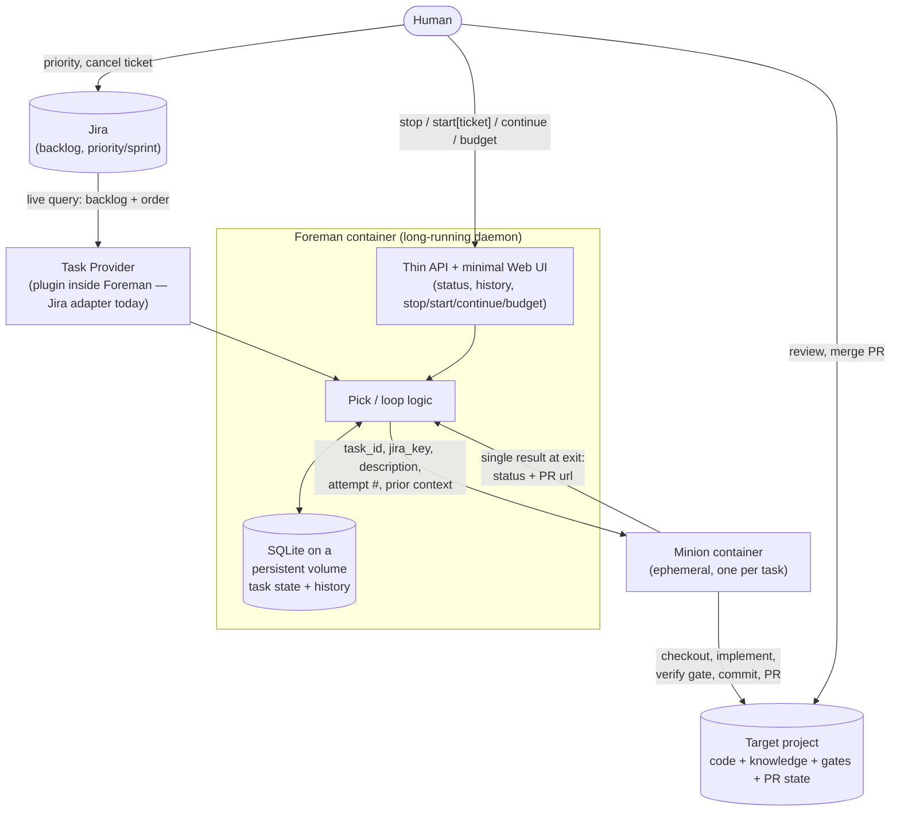

# Instrumenta — architecture

This is the single place the whole process is described end to end: the components,
what each one owns, and how they connect. See [vision.md](vision.md) for why the system
exists and what it's for; see the [ADRs](adr/INDEX.md) for the reasoning behind
individual decisions this document just states as given.

## The shape



Five things that matter, and one thing that deliberately doesn't exist: there is no
knowledge store, no queue store, and no callback API separate from what's listed above —
each was considered and folded into one of these five once it became clear it didn't
need to be its own thing. That reasoning lives in the ADRs; this document just states
the result.

## Components

### Jira (external)

The only task source for the MVP. It already is a backlog with ordering (priority,
sprint) — Foreman never copies that into its own storage, it reads it live on every
Pick. A human reordering, prioritizing, or cancelling a task does so directly in Jira;
Foreman sees the effect on the next query without any reconciliation step.

### Task Provider (module inside Foreman, not a container)

Adapts one or more sources into a common backlog-item shape. One adapter exists today
(Jira); the interface is source-agnostic so a second source (a different tracker,
`docs/todo/`-style local entries) can be added later as a new adapter without changing
Foreman's loop. It isn't split into its own container: there is no isolation,
scaling, or independent-deployment reason to pay a network hop for what is otherwise a
well-behaved API client.

### Foreman (container, long-running daemon)

The only component that runs continuously. Internally:

```
while not stopped:
    task = pick()                 # Task Provider (Jira) + eligibility check
    if task is None:
        sleep(poll_interval)
        continue
    result = dispatch(task)       # start Minion, wait synchronously for exit
    record(result)                # SQLite: attempt, status, PR url, timestamps
    mirror_status_to_jira(task, result)
    if budget is set:
        budget -= 1
        if budget == 0: break
```

Foreman owns two things directly:

- **SQLite on a persistent Docker volume** — the only state instrumenta keeps for
  itself. Schema: `task_id (uuid, pk) | jira_key | attempt_number | status | pr_url |
  dispatched_at | finished_at`, plus a `stopped` flag. Only Foreman reads or writes it.
  Why this exists and what it's authoritative for (and what it isn't) is
  [ADR-001](adr/001-task-state-three-sources.md).
- **A thin API, and a minimal Web UI on top of the same API, served from the same
  container.** One page: current status, the queue as Task Provider would return it,
  a history table from SQLite, and four controls — stop, continue, start with a
  specific ticket, and an optional budget (do at most N tasks, then stop). No separate
  CLI artifact: anyone who wants scriptable access hits the API directly. Why a daemon
  instead of an externally-triggered job, and exactly what stop/continue/start/budget
  do and don't affect, is
  [ADR-003](adr/003-foreman-daemon-trigger-control.md).

Foreman never executes target-authored or LLM-directed shell commands itself — that's
Minion's job, deliberately kept out of Foreman's own trust boundary. See ADR-002.

### Minion (container, ephemeral, one per dispatched task)

Spun up by Foreman with everything it needs at start — `task_id`, `jira_key`, the
normalized task description, the attempt number, context from prior failed attempts if
this is a retry, and scoped credentials for the target repository. Destroyed after.

Inside:

1. Checkout the target project; branch named after `jira_key` (not the internal UUID —
   the branch name is what a human reviewing the target repo actually sees).
2. The agent implements the task (Claude Code, run with
   `--dangerously-skip-permissions` — the container boundary is what compensates for
   turning off interactive tool approval; see [ADR-002](adr/002-foreman-minion-execution-boundary.md)).
3. Look for a `verify` gate already defined in the target project.
   - Missing → don't commit, don't open a PR. Write a note, at the target project's
     configured notes path, that the project has no verify gate. Report
     `blocked_no_verify`.
   - Present → run it.
     - Fails → don't commit. Report `failed_verify`.
     - Passes → commit, open the PR. Report `success` with the PR url.
4. If this was the final allowed attempt and it still didn't succeed, Minion itself
   writes a give-up note at that same path before reporting `given_up` — the same
   PR-review path a human contributor's work would go through.

Where that note goes is configurable, unlike `verify` — there's a safe default
(`docs/todo/`), so a missing convention isn't a hard stop the way a missing gate is. A
target project can redirect it (e.g. `instrumenta/review/`) via a small config value in
its own repository, which Minion reads at checkout alongside looking for `verify`. See
[ADR-002](adr/002-foreman-minion-execution-boundary.md).

Minion has no API of its own and doesn't push status anywhere mid-run. Foreman starts
the container and waits synchronously for it to exit, then reads one structured result
(status + PR url, if any). There is deliberately no live-progress callback channel here
— that machinery is exactly the piece that never got finished in the prior art this
design was checked against, and Foreman doesn't need it: a single result at exit is
enough to record the outcome and decide the next Pick. Foreman enforces a timeout and
kills Minion if it's exceeded, recording the run as a failed attempt directly — see
[ADR-001](adr/001-task-state-three-sources.md) for why this specific case (a crash or
hang with no PR ever opened) needed something beyond git/GitHub state to catch.

### Target project (external repository, human-owned)

Carries everything about the target project that isn't Foreman's own operational
bookkeeping: the code, the accumulated knowledge (ADRs, glossary, and the notes Minion
writes at the project's configured notes path — `docs/todo/` by default, arriving as
ordinary PRs, reviewed like any other change), the gate the project defines for itself
(the `verify` mechanism), and the git/GitHub state (branches, PRs) that backstops
give-up detection. Nothing here is instrumenta-specific infrastructure;
a human could delete every trace of instrumenta having worked here and the project
would still make complete sense on its own.

### Human

Two distinct relationships, not one generic "human in the loop":

- **To Foreman**, through the API/UI: stop, continue, start[ticket], budget. Lifecycle
  control only — nothing about task content flows through this channel.
- **To Jira and the target project directly**: reordering/cancelling tasks, reviewing
  and merging PRs, adding knowledge or a new gate. All of this is the human doing what
  they'd do anyway with those systems; instrumenta doesn't sit in the middle of it.

## Where task/claim state actually lives

Three sources, each authoritative for a different question — not three copies voting
on the same fact. Full reasoning and the exact combination rule for give-up is
[ADR-001](adr/001-task-state-three-sources.md):

| Source | Answers |
|---|---|
| Jira (live query) | Is this task still wanted at all? |
| SQLite (Foreman's own) | What has Foreman itself observed about its attempts — including a crash or timeout with no PR to show for it? |
| GitHub (target repo PR history) | Resilient backstop for give-up if SQLite is ever lost or diverges from reality. |

## Known, accepted gaps

Named here rather than hidden, each with a revisit trigger in its owning ADR:

- A Minion that hangs or crashes *before* Foreman's own timeout fires, or in a way
  Foreman's process itself doesn't observe, can still leave a task in an ambiguous
  state. Mitigated, not eliminated, by Foreman owning the wait and the timeout.
- **Foreman's own process crashing mid-loop** — not Minion's — relies entirely on the
  container-runtime restart policy being configured correctly; there's no external tick
  to catch it the way an externally-triggered design would have
  ([ADR-003](adr/003-foreman-daemon-trigger-control.md)).
- **Stop** doesn't abort a Minion already in flight — it only prevents the next Pick.
  A human wanting to hard-cancel running work has no mechanism yet
  ([ADR-003](adr/003-foreman-daemon-trigger-control.md)).
