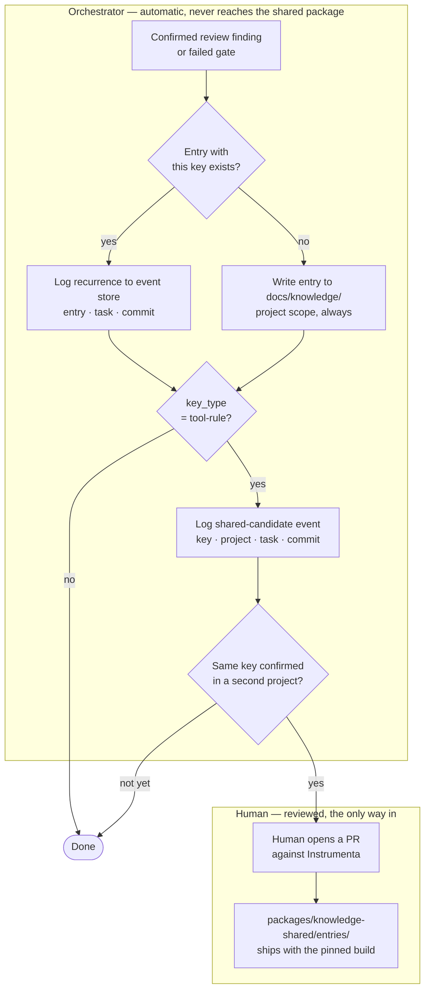

# 017 — The knowledge layer, stated once

Date: 2026-08-10. Supersedes ADR-004, ADR-007, ADR-010, ADR-013, ADR-015, and ADR-016 by
restating them as one design. **No decision changes here.** Every rule below was already
taken in one of those six; this ADR only stops them being six.

## Why consolidate

Four of the sixteen ADRs preceding this one existed only to patch conflicts between the
others, all four on this one subject — their own opening lines say so: ADR-010 "resolves
a conflict between ADR-001/004/007 and ADR-009," ADR-013 "closes a gap between ADR-001's
'thin' scope guard and ADR-010's write mechanism," ADR-015 "resolves a contradiction
between ADR-004 and ADR-010/013," and ADR-016 amends ADR-004 and ADR-007 again.

Each patch was correct and each was found the same way — re-reading the set together, or
running `docs-consistency-check`. That is the signal: a design that needs a conflict-
resolution ADR every time it is touched is not being read as a whole, because it cannot
be. The most recent pass found four more conflicts inside the same six documents.

The other ten produced no findings. They are left alone.

Now is the cheap moment: there is no product code, so nothing depends on any of this yet.

## What a knowledge entry is

**Origin (from ADR-001, unchanged).** An entry comes only from a confirmed review finding
or a failed gate — never from the Coding agent describing its own work. "Confirmed" means
the finding sent the task back to `Coding` (ADR-006), i.e. it caused a real fix rather
than a passing comment.

**Two independent axes.** Scope decides _who loads_ the entry; key type decides _what
retrieves_ it. Before ADR-016 these were welded together; they are not.

| Axis       | Values                                                                                                   |
| ---------- | -------------------------------------------------------------------------------------------------------- |
| `scope`    | `project` — one repository · `shared` — every project                                                    |
| `key_type` | `path` — fires when the agent touches matching files · `tool-rule` — fires when a gate reports that rule |

Three of the four combinations are meaningful. **`scope: shared` with `key_type: path` is
invalid** and rejected on write: paths mean nothing across repositories.

`key_type` is an explicit field, never sniffed from the key's text.
`security/detect-object-injection` contains a slash and is a rule, not a path — any
heuristic gets that case wrong, and it is the case this design most needs to get right.

**Key notation.** A path key is a path prefix. A `tool-rule` key is `engine:rule-id`,
where `rule-id` is spelled the way the engine reports it:

- **Engine, not platform.** The same ESLint rule fires from a local run or through a
  hosted scanner; the engine is the stable identity, the platform that reported it is not
  part of the key.
- **Engine, not plugin.** An ESLint rule id already carries its plugin, so
  `eslint:security/detect-object-injection` — not `eslint-plugin-security:…`, which says
  it twice.
- **Bare rule names are not keys.** `avoid-v-html` with no engine can collide across
  engines; a Semgrep rule takes its fully-qualified id.

One finding must have exactly one spelling, because key equality is the counting
primitive the thesis test runs on (below).

**File format.** One Markdown file per entry, frontmatter plus body — the same shape as
the ADRs in this directory, because an entry is meant to be read by a maintainer in
review and cross-linked like one. The event store records _that_ an entry exists and
which commit produced it; the content lives in the file.

```yaml
---
id: 2026-08-10-object-injection-registry-lookup
scope: project | shared
key_type: path | tool-rule
key: apps/orchestrator/src/registry/ # or: eslint:security/detect-object-injection
commit: <sha that produced this entry>
date: 2026-08-10
supersedes: <id> # optional, and always a manual maintainer edit
summary: one line, shown in retrieval logs without opening the file
---
Body: the finding or rule, in prose. What happened, why it's a false positive or a real
rule, and what to do differently next time.
```

**Directories.**

- **Project** — `docs/knowledge/` in the target repository. For MVP that repository is
  Instrumenta itself, so the directory lives here too, parallel to `docs/decisions/`. On a
  second project the knowledge port (ADR-003) reads the same relative path inside
  whichever repo it points at.
- **Shared** — `packages/knowledge-shared/entries/`, a real workspace package (ADR-002),
  not `docs/`. Deliberate: shared entries are runtime data the orchestrator loads to act
  on gate failures, not documentation about Instrumenta. "Released with the build" means
  it ships as a package, versioned and installed like the rest of the code, which is what
  makes a run under a pinned build (ADR-012) reproducible.

Shared knowledge is **not** behind ADR-003's knowledge-source port. That port is per
project; shared knowledge belongs to the tool and travels with it.

## Who writes an entry, and when

**The orchestrator writes the file. No agent does.** ADR-001 excludes the Coding agent;
ADR-009 scoped the Review session to read-only tools so it cannot approve its own fix,
which also means it cannot write. That left nothing able to write the file until ADR-010
resolved it: the Review session returns the finding as **structured output** — finding
text, scope, key type, key, commit — and the orchestrator formats it into the frontmatter
above. A failed gate needs no agent step at all, since gate output is already structured
(tool, rule, file).

This keeps the Review session exactly as read-only as ADR-009 committed to — it returns
data, not files — and needs no third agent role or third permission set. Its output
contract is therefore architectural, not a display detail.

**On a matching `key`, no new file is written.** The orchestrator logs the recurrence to
the event store (ADR-005) instead: which entry matched, which task and commit hit it
again. The existing entry's content is left as written.

That is what keeps the base thin by construction — one file per key, ever — and it is
what makes the thesis test readable: count recurrences per key where an entry already
existed at retrieval time. A recurrence can then mean only one thing, that the entry
existed and either wasn't retrieved or didn't help, instead of being masked by a fresh
file each time.

`supersedes` is not automated. Deciding whether an old entry is now wrong or merely
incomplete is judgment a template-filling orchestrator step does not have.

## The shared scope: writing, promotion, and what the evidence actually is

**The orchestrator's direct-write path only ever targets `docs/knowledge/` — project
scope. It never writes to `packages/knowledge-shared/entries/`.**

When a confirmed finding or failed gate carries a `tool-rule` key, the orchestrator does
what it does for any other finding: write the project-scoped entry, or skip and log the
recurrence. In addition it logs a **shared-candidate event** to the event store — the key,
the project, the task, the commit — whether or not a matching project entry existed.

The whole path, since keeping the automatic half out of the shared directory is what took
four ADRs to get right:



**Promotion bar: the same key confirmed in a second _project_.** Not a second occurrence.
Two different projects' event logs must carry a shared-candidate event for the same key;
a file appearing twice in one repository is not promotion. ADR-007 once restated the bar
as "a second confirmed occurrence," which is a different and looser rule — this is the
one that holds, for the reason ADR-004 gave: the shared base is loaded for every task on
every project, the most expensive place in the system for noise. Three hits in one
codebase can just as easily mean that codebase indexes objects a lot.

**Promotion is a human opening a PR against Instrumenta.** Every entry in the base that
all projects read passes the same external review the architecture demands everywhere
else — nothing writes to it unseen. The cost is that another project sees a new entry only
after a release; acceptable while promotion is rare and evidence-gated.

**Learning stays deliberately dumb:** count confirmed recurrences of a key, promote at the
bar. No model generalises entries into rules, nothing is inferred from embeddings. A
generalised entry cannot be verified against anything, and a wrong entry in the shared
base is loaded everywhere. Evidence-based promotion is slower and it is the only kind that
can be audited.

**The evidence for having a shared scope at all is one observation.** ADR-004 justified
the scope with `../vision.md`'s "seven corrective commits, all one class ... spans two
separate codebases." Checked against the real repositories, that count was wrong in the
direction that mattered: those seven commits span six distinct `tool:rule` keys, and under
the old count **no single key crossed the repository boundary** — each repo had its own
rules. The corrected sweep contains exactly one that does, `eslint:xss/no-mixed-html`. So
"measured rather than assumed" here means _n = 1_, and nothing downstream should quote it
as more.

One cross-project recurrence is still enough to keep the split, because the alternative —
discovering the need after retrieval is built around a single path key — is the expensive
direction. But it is a live risk, which is why the revisit trigger below is sharp.

**Addressable ceiling: 4 corrections in 70 PRs (5.7%), of which 1 needs shared scope.**
Knowledge only helps from a key's second occurrence onward, so two per recurring key.
`../vision.md`'s 8.6% counts PRs _touched by_ a recurring key, not turns a knowledge layer
could have saved; the thesis test must not be read against the larger number.

**MVP seed.** Promotion needs a second project and MVP has one, so the shared base does
not learn yet — during MVP it is seeded by hand, and the seed is now specific rather than
gestural:

| Scope     | Key                                       |
| --------- | ----------------------------------------- |
| `shared`  | `eslint:xss/no-mixed-html`                |
| `project` | `eslint:security/detect-object-injection` |

The other four measured keys seed nothing — a singleton is not knowledge yet. Calling this
base "learned" would be a lie; it is a starting corpus with a learning path attached.

**Cold start.** ADR-001 accepted that targeting Instrumenta itself leaves nothing to
accumulate against. The shared scope softens that — cross-project findings and process
conventions are useful from the first task — without removing it, since project-scoped
knowledge still starts empty.

## What this ADR does not touch

ADR-001's thesis and its "thin" scope guard; ADR-003's ports; ADR-005's event store;
ADR-006's state machine and retry cap; ADR-009's read-only Review session; ADR-012's
pinned build. Each is referenced above and none is restated or changed.

## Provenance

Where each superseded decision now lives, so an old ADR's reader can follow it forward:

| Superseded | Its decision, now in this ADR                                          |
| ---------- | ---------------------------------------------------------------------- |
| ADR-004    | scopes, retrieval axes, promotion bar, shared directory, dumb learning |
| ADR-007    | file format, frontmatter, both directories                             |
| ADR-010    | orchestrator writes the file; Review returns structured output         |
| ADR-013    | same key → no new file, recurrence logged to the event store           |
| ADR-015    | direct-write path is project-only; shared-candidate events             |
| ADR-016    | corrected evidence, key/scope split, key notation, seed, ceiling       |

The six files stay on record, marked superseded. They hold the reasoning that produced
each step, which this ADR deliberately does not repeat — a reader who wants to know _why_
the design moved should read them in order.

One phrasing is retired rather than carried: ADR-015 spoke of "a key shaped for shared
scope (`tool:rule`)", which ADR-016 made false — a `tool-rule` key is an ordinary project
key until the bar is met. The mechanism it described is unchanged.

## Reversibility

Two-way door on everything here except one thing. Frontmatter gains optional fields
without breaking entries; directories move by rename; collapsing the two scopes into one
now costs moving a single seeded entry. The load-bearing exception is the same one ADR-004
named: splitting one scope into two _after_ retrieval is built around a single key is a
redesign, not a migration — which is the whole reason the split is being kept on thin
evidence rather than deferred.

Consolidating six ADRs into one is itself reversible in git and irreversible in habit.
This repository's rule is that a later ADR amends an earlier one by number rather than
editing it, and ADR-014 builds a permission boundary around that. This consolidation is
the exception that pays for itself only because no code exists yet; it should not become
the way conflicts are normally resolved.

## Revisit triggers

- **Second project** (ADR-003's trigger). The first real test of the promotion bar, of
  shared-candidate events, and of `docs/knowledge/` as a fixed relative path. All three
  are unverifiable with one project in play.
- **No second cross-project recurrence by the time a second project has completed twenty
  tasks** — the same horizon ADR-001 set and ADR-006 and `../vision.md` already read
  against, rather than a number of this ADR's own. The single observation behind the
  shared scope was then a coincidence, and the split should collapse while it still costs
  one entry to undo.
- **Shared entries needing project-specific exceptions.** The split was drawn on the wrong
  axis — something other than project-boundedness.
- **Recurrence events piling up against a stale entry.** A human should have revised it
  via `supersedes` and didn't notice. That is a Cockpit surfacing problem first — show
  recurrence counts per entry — not a reason to automate supersession.
- **Orchestrator formatting needing judgment templating doesn't have**, e.g. the same key
  needing meaningfully different write-ups per occurrence. That would earn a scribe role;
  nothing today suggests it.
